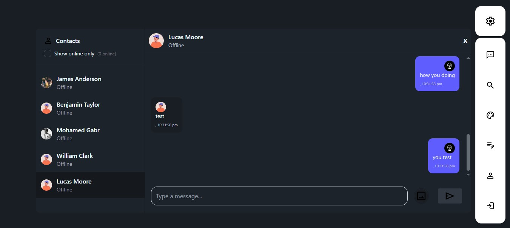

# 🔥 Project
- Chatty is an advanced chat web app with some crazy amazing features. A real world project ready for production. It handles user privacy and easy to use. Real time functions that makes the app fast.

# 🔗 Live Demo


👉 [View]()

# 🛠️ Tech Stack
- Node JS
- Express JS
- GraphQL / Apollo (Server & Client)
- PostgreSQL
- Cloudinary
- JWT
- Passport JS
- Socket.IO
- React JS
- Tailwind CSS
- Daisy UI
- Zustand

# 👨‍💻 Code Overview
- Handle user auth using cookies and JWT.
- GraphQL back end design
- State management using zustand

# 💎 Features
- Full User Authentication System
    - Sign UP
    - Sign IN
    - Forget Password 👉 Using user Email to send a reset password link
    - Reset password 👉 Using a reset link that is valid to use for only one time
    - Login with Google
- Search 👉 You can search for any user.
- Privacy 👉 The ability to make your account private so only user who have your ID can send you a message.
- Real Time Functions
    - Show if user is online or offline
    - Sending messages fast
- Filter 👉 You can filter users by showing only the online users.
- Edit your profile 👉 you can edit all of your information like your name, bio, email, or profile pictures.
- Themes 👉 You can change your theme by choosing from different 35 theme.

# 📂 Pages
- Signup / signin / forget password / reset password pages.
- Chat Page
- Profile Page
- Edit Profile Page
- Search Page
- Theme Page

# ⚡ Quick Start

1. Step 1: Clone this repo
```bash
git clone git@github.com:MO-GBR/chat_app.git
```
2. Step 2: ENV Files
- Client
```bash
VITE_MODE="production"
VITE_DEVELOPMENT_GQL_URL="http://localhost:5000/graphql"
VITE_BASE_URL="http://localhost:5000/"
VITE_PRODUCTION_GQL_URL="/graphql"
```
- Api
```bash
PORT=5000
PG_USER=
PG_PASSWORD=
PG_HOST=
PG_PORT=
PG_DATABASE=
JWT_SECRET=
CLOUDINARY_CLOUD_NAME=
CLOUDINARY_API_KEY=
CLOUDINARY_API_SECRET=
EMAIL_SERVICE=
EMAIL_USERNAME=
EMAIL_PASSWORD=
EMAIL_FROM=
CLIENT_URL="http://localhost:5000"
GOOGLE_CLIENT_ID=
GOOGLE_CLIENT_SECRET=
NODE_ENV="production"
```
3. Step 3: Run this Command
```bash
cd chat_app && npm run build && npm run start
```
- It will do 5 things
    1. Access the smart_ecom_website folder.
    2. Install dependencies in the api folder.
    3. Install dependencies in the client folder.
    4. Build the dist folder in the client (Front-end).
    5. Start the Api Server (Back-end).

4. Step 4: Open http://localhost:5000/ on your browser